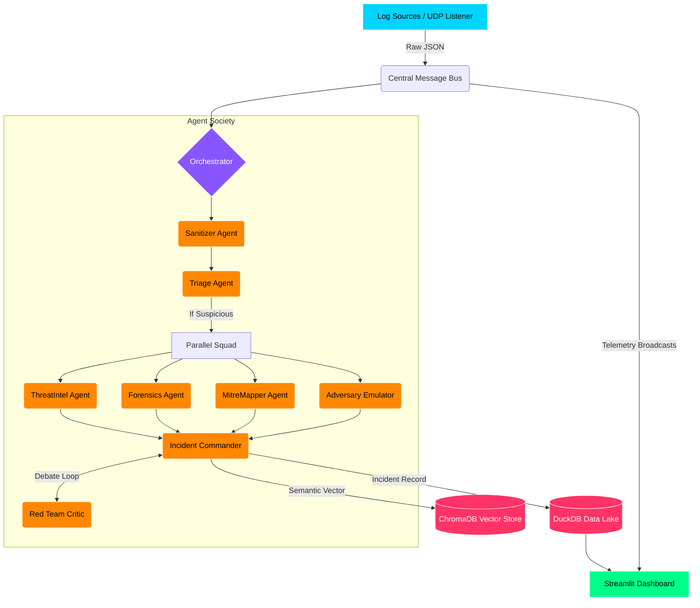
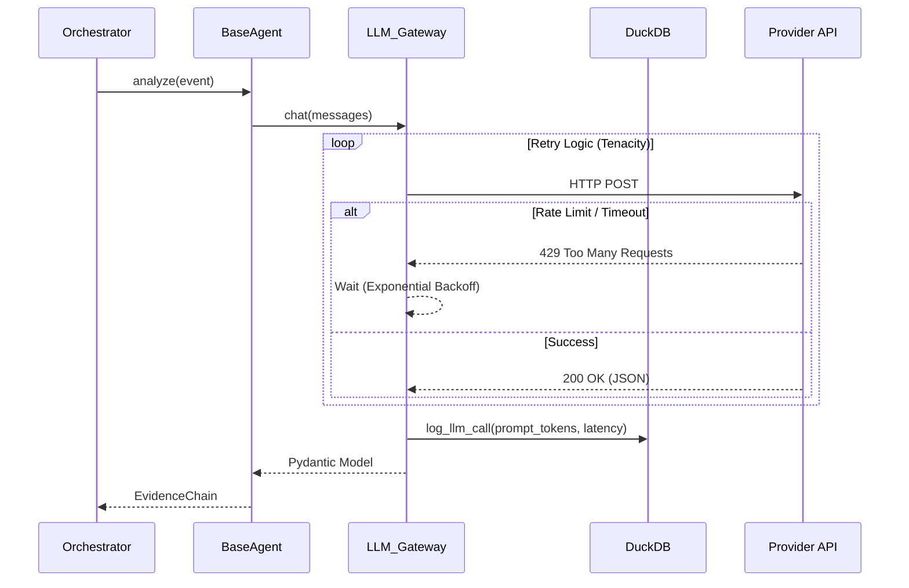

# 🛡️ SENTINEL-AI

**SENTINEL-AI** is a predictive, next-generation Security Information and Event Management (SIEM) platform and Agentic SOC, engineered natively for Windows. It leverages a multi-agent society of specialized LLMs to perform automated ingestion, analysis, threat hunting, and incident summarization in real-time.

---

## 🏗️ Architecture Overview

SENTINEL-AI is designed as an event-driven, decoupled architecture to ensure maximum scalability and high throughput. 



### 1. Ingestion & Message Broker
Logs enter the system via standalone listeners (e.g., Syslog UDP servers) and are pushed to the **Message Bus**. The Message Bus decouples ingestion from processing, allowing the system to handle massive log bursts without dropping packets.

### 🧠 Multi-Agent Society Architecture
Instead of relying on rigid, rule-based alerts, SENTINEL-AI acts as a live, autonomous SOC. When an event enters the pipeline, it is investigated by a society of specialized AI agents working in parallel. This decoupling ensures each LLM prompt is highly scoped and focused, preventing context degradation.

1. **🛡️ SanitizerAgent**: Acts as the system's immune system. Inspects raw event logs to neutralize Prompt Injection attacks before they reach the core LLM reasoning engines.
2. **🔍 TriageAgent**: Operates as the front-line analyst. Rapidly drops benign noise and deduplicates alerts, heavily reducing expensive LLM inference costs down the pipeline.
3. **🌐 ThreatIntelAgent**: Operates in the parallel squad. Enriches unknown IPs, file hashes, and domains against known threat feeds to provide vital IOC context.
4. **🔬 ForensicsAgent**: Operates in the parallel squad. Deep-dives into the DuckDB data lake using time-window heuristics to correlate historical and related events for the affected host or user.
5. **🗺️ MitreMapperAgent**: Operates in the parallel squad. Translates raw telemetry into standard cybersecurity taxonomy, mapping attacker behaviors directly to the **MITRE ATT&CK Kill Chain**.
6. **⚔️ AdversaryEmulatorAgent**: Operates in the parallel squad. Uses predictive modeling and "attacker mindset" reasoning to anticipate the attacker's next likely lateral move or persistence mechanism.
7. **🟢 IncidentCommanderAgent**: The supreme orchestrator. Synthesizes the massive parallel squad's outputs into a final, actionable incident report with an aggregated confidence score.
8. **🔴 RedTeamCriticAgent**: Actively debates the Commander. It plays devil's advocate, attempting to find flaws, alternative benign hypotheses, or gaps in the investigation to prevent false positives before human escalation.
9. **📋 ComplianceReporterAgent**: Once the debate settles, this agent translates the technical incident chain into an executive-ready Markdown or PDF report mapped to compliance controls.

## 💻 Technology Stack & Scalability Choices

### CAMEL AI (Agentic Framework)
* **Purpose**: Foundational framework and design pattern for the Multi-Agent Society.
* **Reason for Choice**: The orchestration architecture is deeply inspired by CAMEL (Communicative Agents for "Mind" Exploration of Large Scale Language Model Society). Specifically, the role-playing and communicative agent design is implemented in our **Debate Loop**, where the `IncidentCommanderAgent` and `RedTeamCriticAgent` engage in an adversarial, autonomous debate to continuously refine the final conclusion, challenge assumptions, and eliminate LLM hallucinations before raising human alerts.

### DuckDB (Data Lake)
* **Purpose**: High-speed, persistent storage for raw events, enriched telemetry, and incident records.
* **Reason for Choice**: Traditional SOCs rely on Elasticsearch or Splunk, which require massive JVM/Linux overhead. DuckDB provides blazing-fast vectorized analytical queries (OLAP) directly on local disk. It is natively embedded in Python, requires zero server setup, and scales effortlessly to millions of rows on a standard Windows machine.

### Streamlit (Operations Center)
* **Purpose**: Real-time, glassmorphic UI for monitoring agent telemetry and incident reports.
* **Reason for Choice**: Streamlit abstracts away frontend boilerplate. Because it runs on Python, it shares direct memory access with the DuckDB instance and Message Bus. This allows the dashboard to listen to live telemetry broadcasts (like tokens-per-second) and auto-render them natively without complex REST APIs or WebSockets.

### ChromaDB (Semantic Memory)
* **Purpose**: Vector database for storing past incidents.
* **Reason for Choice**: To prevent the agents from making the same mistakes twice, ChromaDB allows the `LearningLoop` to retrieve past similar incidents via semantic similarity search. ChromaDB runs purely locally, avoiding cloud vector-store latency.

### LLM Gateway & Tenacity
* **Purpose**: Interfacing with inference engines (like Cerebras).
* **Reason for Choice**: Network calls to LLMs can fail or hit rate limits. The backend uses `tenacity` for exponential backoff and automatic retries.



---

## 🚀 Getting Started

### Prerequisites
- Python 3.9+
- Windows OS

### Installation
1. Clone the repository and navigate to the project root:
   ```cmd
   cd sentinel-ai
   ```
2. Install the required dependencies:
   ```cmd
   pip install -r requirements.txt
   ```
3. (Optional) For live LLM inference, create a `.env` file in the root directory and add your API key:
   ```env
   CEREBRAS_API_KEY="your_api_key_here"
   SENTINEL_DEMO_MODE="false"
   ```

### Running the Platform
Simply execute the native batch script to initialize the DuckDB data lake, seed the simulation data, and launch the Operations Center dashboard:
```cmd
run_demo.bat
```

Navigate to `http://localhost:8501` in your browser to watch the Agent Society in action!
